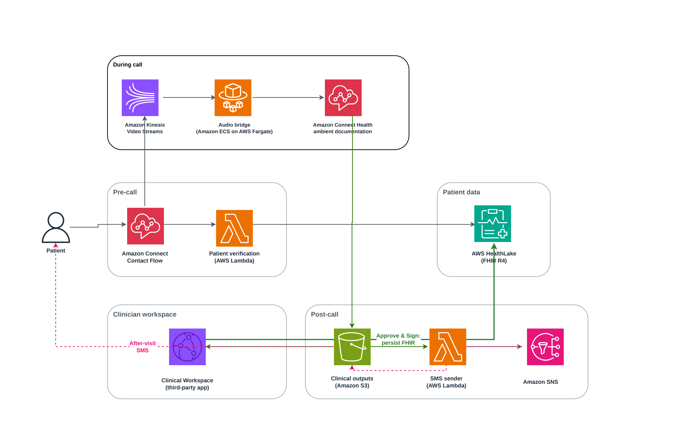
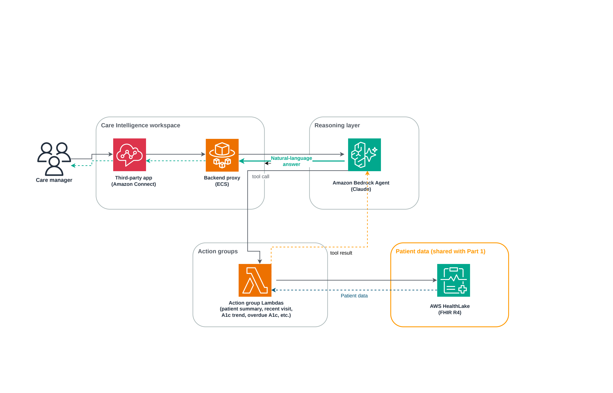

# Building a Unified Clinical Workflow on Amazon Connect

A two-part sample demonstrating how to build provider and care-manager
workflows on AWS using Amazon Connect Health, AWS HealthLake, and Amazon
Bedrock. Companion code for the AWS for Industries blog series:

- **Part 1**: Building a unified clinical workflow on Amazon Connect: From
  patient call to documentation in a single workspace
- **Part 2**: Closing the loop: From clinical documentation to care manager
  insight with Amazon Bedrock and AWS HealthLake

> ⚠️ **Sample / not for production without configuration.** Before
> handling real patient data, you must configure Amazon Bedrock
> Guardrails, execute a BAA with AWS, harden IAM, and implement audit
> logging. See [`NOTICE.md`](NOTICE.md) and
> [`RESPONSIBLE_AI.md`](RESPONSIBLE_AI.md).


## What this sample shows

Two complementary workflows on top of a single Amazon Connect Health domain,
sharing one AWS HealthLake datastore:

### Provider workflow (Part 1)

A clinician handles an entire patient encounter inside the Amazon Connect
Agent Workspace. Five Amazon Connect Health capabilities (patient
verification, appointment management, patient insights, ambient
documentation, and medical coding) are brought into the workspace through
a third-party application. The clinician answers a verified call to a
fully-prepared chart, has a normal conversation while the system listens
and structures it, reviews and approves AI-generated SOAP notes and medical
codes, and the data lands in AWS HealthLake as standard FHIR R4 resources.

### Care manager workflow (Part 2)

A care manager queries the same FHIR data in natural language through a
second third-party application, also embedded in Amazon Connect Agent
Workspace. Amazon Bedrock Agents reason over the question, call action
groups (one Lambda per domain task), retrieve FHIR resources from
HealthLake, and compose a natural-language response. No ETL pipeline. No
batch jobs. Today's encounters are queryable today.

## Architecture

The two workflows share one Amazon Connect Health domain and one HealthLake
datastore, the data the clinician writes is the data the care manager
reads.

### Figure 1 — Provider workflow

A clinician answers a verified call, has a natural conversation while Amazon
Connect Health listens and structures the encounter, then reviews and approves
AI-generated SOAP notes and medical codes before they land in AWS HealthLake.



*Source: [`docs/images/figure-1-provider-workflow.pdf`](docs/images/figure-1-provider-workflow.pdf) (draw.io editable).*

### Figure 2 — Care manager workflow

A care manager asks natural-language population-health questions. An Amazon
Bedrock Agent reasons over the request, invokes the right action-group Lambda,
retrieves FHIR resources from HealthLake, and composes an evidence-linked
answer. No ETL, no batch — today's encounter is queryable today.



*Source: [`docs/images/figure-2-care-manager-workflow.pdf`](docs/images/figure-2-care-manager-workflow.pdf) (draw.io editable).*

For the full architecture narrative and ASCII flow diagrams, see
[`docs/architecture.md`](docs/architecture.md).

| Layer | Provider workflow | Care manager workflow |
|---|---|---|
| User experience | Amazon Connect Agent Workspace + Clinical Workspace third-party app | Amazon Connect Agent Workspace + Care Intelligence third-party app |
| Compute (frontend) | CloudFront + S3 (static) | CloudFront + S3 (static) |
| Compute (backend) | ECS Fargate (Python Flask) | ECS Fargate (Python Flask proxy to Bedrock) |
| AI / Reasoning | Amazon Connect Health (verification, insights, ambient docs, codes) + Amazon Bedrock (narrative synthesis) | Amazon Bedrock Agents with custom action groups |
| Audio capture | Amazon Connect → Kinesis Video Streams → ECS Java bridge | _(none — care manager workflow is non-voice)_ |
| Data plane | AWS HealthLake (FHIR R4) + Amazon S3 (clinical outputs) | AWS HealthLake (FHIR R4) |
| Patient comms | S3 event → AWS Lambda → Amazon SNS (SMS) | _(not applicable)_ |


## Repository structure

```
sample-amazon-connect-health-unified-clinical-workflow/
├── README.md                    ← you are here
├── NOTICE.md                    ← synthetic-data attestation + production prereqs
├── RESPONSIBLE_AI.md            ← responsible-AI commitments
├── SECURITY.md                  ← vulnerability disclosure policy
├── CHANGELOG.md
├── LICENSE                      ← MIT-0
│
├── provider-workflow/           ← Part 1 — provider workspace
│   ├── README.md
│   ├── backend/                 ← Python Flask backend (ECS Fargate)
│   ├── bridge/                  ← Java KVS→ambient-docs bridge (ECS Fargate)
│   ├── frontend/                ← Clinical Workspace third-party app
│   ├── lambdas/                 ← patient-verification, sms-notification
│   ├── connect-flow/            ← Contact Flow JSON
│   └── infrastructure/          ← CloudFormation
│
├── care-manager-workflow/       ← Part 2 — care manager workspace
│   ├── README.md
│   ├── frontend/                ← Care Intelligence third-party app
│   ├── backend/                 ← Flask proxy to Bedrock
│   ├── bedrock-agent/           ← Agent + action group schemas + Lambdas
│   └── infrastructure/          ← CloudFormation
│
├── shared/                      ← Cross-workflow assets
│   ├── healthlake/              ← Sample FHIR data loader
│   ├── cloudformation/          ← Shared infrastructure (datastore, domain)
│   └── bedrock-guardrails/      ← Healthcare Bedrock Guardrail template
│
├── docs/                        ← Detailed guides
│   ├── architecture.md
│   ├── deployment-guide.md
│   ├── demo-mode-guide.md
│   └── HIPAA-NOTICE.md
│
├── scripts/                     ← Deployment + security tooling
│   ├── pre-commit-security-check.sh
│   └── install-hooks.sh
│
├── .gitlab-ci.yml               ← Lint + security + test pipeline
└── .gitlab/                     ← MR templates
```

## Who is this for?

This repository serves two distinct audiences. **Pick the path that fits
your goal. The two are different experiences with different requirements.**

### 🧑⚕️ "I want to see what this looks like": no AWS account needed

Healthcare leaders, blog readers, AWS Solutions Architects pitching this
to customers, anyone evaluating the architecture before committing
deployment effort.

→ **Run [demo mode](docs/demo-mode-guide.md)** on your laptop. Clones the
repo, runs `python3 server.py --demo`, opens a browser. Shows the
Clinical Workspace UI populated with cached Synthea-generated patient
data. No AWS credentials, no AWS account, no Docker, no infrastructure.

What you'll see: provider workflow UX, patient pre-visit insights, AI-
generated SOAP notes, medical codes, after-visit summary, and the
AI-content disclaimers.

### 🛠️ "I want to deploy this into my AWS account": AWS account required

Healthcare organizations' cloud teams, AWS partner SAs building reference
implementations, anyone planning to wire real Amazon Connect, AWS
HealthLake, and Amazon Bedrock together.

→ **Follow the [deployment guide](docs/deployment-guide.md)**.
You'll need AWS CLI access, an AWS account with Amazon Connect /
Connect Health / HealthLake / Bedrock enabled, Docker for building
images, and (for production) a Business Associate Addendum executed
with AWS. See [`DEPLOYMENT_NOTES.md`](DEPLOYMENT_NOTES.md) for
practical engineering guidance.

What you'll get: live phone-call → ambient-documentation → FHIR
writeback for the provider workflow, plus a Bedrock Agent answering
natural-language clinical questions for the care manager workflow.

## Quick start (demo audience): no AWS account

**Audience**: anyone evaluating the architecture without an AWS account.

Demo mode runs the provider workflow entirely on your laptop. It serves
Synthea-generated synthetic FHIR data from `provider-workflow/backend/
demo_cache/` instead of making real AWS API calls, no AWS credentials,
no AWS account required.

**What it shows**: the Clinical Workspace UI, pre-visit insights for
three synthetic patients (Elena Rodriguez, Diego Ramirez, Márcia
Oliveria), AI-generated SOAP notes, medical codes, after-visit summary,
all required AI-content disclaimers.

**What it does not show**: a real phone call (no Amazon Connect),
real-time ambient documentation, the Approve & Save path that writes to
HealthLake, or the care manager workflow (a future release will add
care manager demo mode, for now that workflow requires a deployed
Bedrock Agent).

```bash
# Clone
git clone https://github.com/aws-samples/sample-amazon-connect-health-unified-clinical-workflow.git
cd sample-amazon-connect-health-unified-clinical-workflow

# Install local security hook (recommended)
bash scripts/install-hooks.sh

# Run the provider-workflow backend in demo mode
cd provider-workflow/backend
python3 -m venv .venv && source .venv/bin/activate
pip install -r requirements.txt
python3 server.py --demo
# Open http://localhost:5000
```

See [`docs/demo-mode-guide.md`](docs/demo-mode-guide.md) for the full demo
walkthrough.

## Quick start (deploy audience): requires AWS account

**Audience**: cloud engineers deploying this into a real AWS account.

For a fully-deployed environment with live Amazon Connect Health, AWS
HealthLake, and Amazon Bedrock, follow the step-by-step guide at
[`docs/deployment-guide.md`](docs/deployment-guide.md). See
[`DEPLOYMENT_NOTES.md`](DEPLOYMENT_NOTES.md) for practical engineering
guidance on the multi-stack deployment.

Summary:

```bash
# 1. Deploy shared infrastructure (HealthLake datastore, Connect Health domain)
aws cloudformation deploy --stack-name unified-cw-shared \
  --template-file shared/cloudformation/shared-resources-stack.yaml \
  --capabilities CAPABILITY_NAMED_IAM

# 2. Deploy the healthcare Bedrock Guardrail (REQUIRED for production use)
aws cloudformation deploy --stack-name unified-cw-guardrail \
  --template-file shared/bedrock-guardrails/healthcare-guardrail.yaml \
  --capabilities CAPABILITY_NAMED_IAM

# 3. Deploy provider workflow
aws cloudformation deploy --stack-name unified-cw-provider \
  --template-file provider-workflow/infrastructure/backend/cloudformation.yaml \
  --capabilities CAPABILITY_NAMED_IAM \
  --parameter-overrides BedrockGuardrailId=<from-step-2>

# 4. Load synthetic Synthea data into HealthLake
bash scripts/load-sample-data.sh
```

## Prerequisites

- An AWS account with access to Amazon Connect, Amazon Connect Health, AWS
  HealthLake, and Amazon Bedrock (Claude model family)
- A Business Associate Addendum (BAA) executed with AWS if connecting to
  real patient data (not required for the synthetic demo)
- Python 3.9 or higher
- Java 17 or higher and Maven 3.6+ (only needed to build the audio bridge)
- AWS CLI configured with credentials for the target account
- A registered Amazon Connect instance (for the workspace third-party app
  pattern)

## Service availability notes

- **Medical Coding** capability of Amazon Connect Health is currently in
  gated preview. Contact your AWS account team for access. The sample's
  ambient documentation, patient insights, and workspace integration work
  independently without medical coding enabled.
- **Amazon Bedrock Guardrails** is generally available. Use the template
  in `shared/bedrock-guardrails/` for healthcare-specific configuration.

## What this sample does NOT include

To set expectations: this sample is a starting point, not a production
system. It deliberately omits:

- Production-grade authentication beyond Cognito basics
- Automated bias monitoring on AI outputs
- ICD-10/CPT validation against current code sets
- Long-term immutable audit logging
- Provider electronic-signature workflows (e.g., 21 CFR Part 11)
- Multi-tenancy (the sample assumes one healthcare organization per
  deployment)

See [`RESPONSIBLE_AI.md`](RESPONSIBLE_AI.md) for the full list.

## Security

- All sample data is synthetic (Synthea-generated). See [`NOTICE.md`](NOTICE.md).
- Bedrock Guardrails configuration is provided but not enabled by default.
  Required for any deployment touching real patient data.
- Pre-commit security checks block accidental commits of credentials,
  PHI, and account IDs. Install with `bash scripts/install-hooks.sh`.
- To report a vulnerability, see [`SECURITY.md`](SECURITY.md).

## Contributing

See [`CONTRIBUTING.md`](CONTRIBUTING.md). Every merge request must pass the
pre-commit security check and the GitLab CI lint stage.

## License

This sample is licensed under the MIT-0 license. See [`LICENSE`](LICENSE).

## Authors

- **Ashish Panwar**: Technical Account Manager, AWS Healthcare
- **Kas Parthasarathy**: Healthcare AI Go-to-Market Lead, AWS

For questions about the sample, open an issue in this repository. For
questions about Amazon Connect Health, AWS HealthLake, or Amazon Bedrock,
contact your AWS account team.
